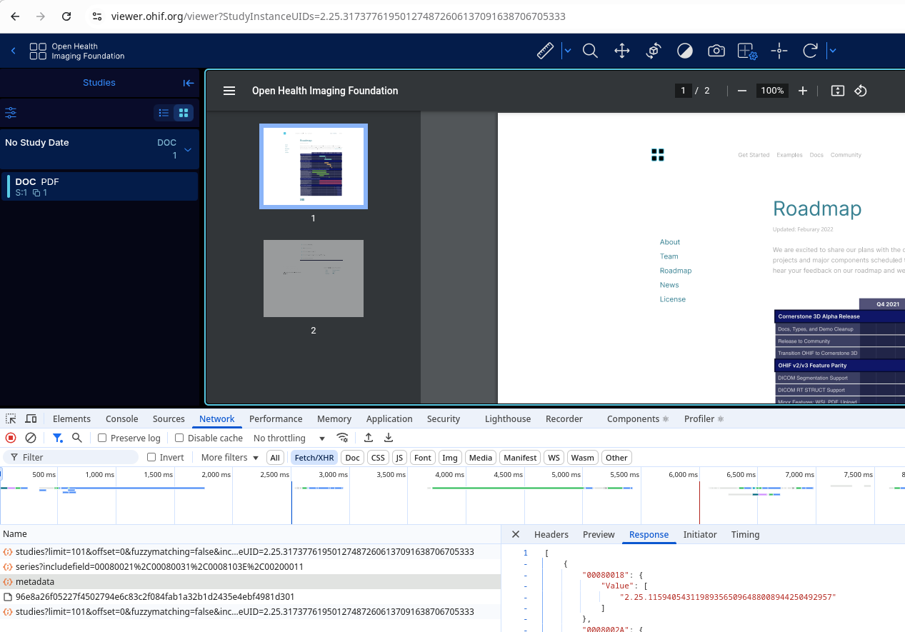

# OHIF Minimal Extension

## Description

The goal of the minimal extension is to determine how to manually provide valid data to the OHIF Viewer. While it requires an extension, it is only making use of the dataSource, allowing defaults throughout the rest of the Viewer to handle everything else.

## Why We Need an Extension

We would like to incorporate the OHIF Viewer within our existing applications. The data behind our systems is not DICOM. As a result, we are trying to understand how to implement a custom datasource which will provide our data to the OHIF Viewer.

Some advice we have received was to convert our data to DICOM format and use that. However, we have more than twenty years of data for multiple clients and a significant codebase which will continue to use and update this data. Conversion is not an appropriate solution.

Additional requirements which lead us to believe we need our own datasource include:
* We need to control access based on the user requesting the data. This does not appear to be supported within the viewer, so we intend to have our datasource verify user identity before determining what data should be available.
* Support for consensus diagnosis:
  * This requires status of a communal process as well as user role conditions.
  * Patient data will be available to selected users.
  * Users may view, make notes and submit a diagnosis.
    * Details are stored for multiple users, but each will only see their own.
    * Users indicate when they have finished their analysis.
  * Moderator will be able to assess a consensus
    * They will see a list of users who have completed as well as any outstanding.
    * Selecting a user who has completed will display notes and diagnosis details from that user.
    * The moderator will prepare a consensus.
  * Users can return to view the consensus once it is complete.

## The Current State of This Example

A single study has been selected from the sample data available by default. The following link sorts data so the study is the first one. The Patient Name is (Empty) and the Modality is DOC.

https://viewer.ohif.org/?sortBy=studyDate&sortDirection=descending

Selecting the Basic Viewer takes you to the following page:

https://viewer.ohif.org/viewer?StudyInstanceUIDs=2.25.317377619501274872606137091638706705333

This screenshot shows some of the page and the inspector. The data requests visible in the inspector are those we are trying to replicate with this extension by using a custom datasource which returns static JSON files in place of these requests.



These are the data requests:

1. studies - returns the studies-doc.json file
1. series - returns the series.json file
1. metadata - returns the metadata.json file
1. pdf - Not implemented, but understood that the bulkdata is transformed to a request to fetch the pdf file.
1. studies - This final request is not understood. What causes the app to make this request and why is it needed?

This particular example may not be the best choice, but it was a small one. Some of the other studies, while they may not have a huge number of images, it is not rare to find a request for metadata returning several million lines of json. It would be helpful if we could eliminate anything unnecessary. While the documentation suggests we need to implement the IWebApiDataSource interface, this does not ensure that the viewer will be happy with the data returned. There is no documentation about required fields or structure within the responses.

## How to set this up

This requires a small change to the core OHIF Viewer app, so you will need a local copy of that as well.

```
git clone https://github.com/certus-tech/ohif-minimal-extension.git
```

### Get the Viewer

Clone the viewer. This will be on the latest version. Change to a released version: 3.9.2.

```
git clone https://github.com/OHIF/Viewers.git
cd Viewers/
git checkout tags/v3.9.2
```

### Build Both Projects

In ohif-minimal-extension, run the following:

```
yarn install
```

In your local Viewers app, run the commands below. The link-extension should be executed AFTER running the install on the extension. The path to minimal-extension should include the folder 'minimal-extension' within the git module.

```
yarn install
yarn cli link-extension <path-to-minimal-extension>
```

Before running the app, apply a patch to set the extension's datasource as the default one. This seemed the easiest way to ensure our datasource was used.

```
git apply <path-to-ohif-minimal-extension>/assets/viewer.patch
```

This completes the setup. You can run the Viewer app:

```
yarn start
```

### What the patch changes

The data sources are defined in the following file:

```
Viewers/platform/app/public/config/default.js
```

The default data source name is changed to 'minimal'.

```
defaultDataSourceName: 'minimal',
```

Add a new datasource is added for the minimal extension. This is inside the 'dataSources: [' array.

```
    {
      namespace: 'minimal-extension.dataSourcesModule.minimal-extension',
      sourceName: 'minimal',
      configuration: {
        friendlyName: 'minimal local',
        name: 'minimal',
      },
    },
```

## The Data Provided

The data is provided from static json files within the extension. The original source of that data came from the public demo app. The public metadata request contained much more data than was relevant to the specific study used in this case. It has been shortened to only include the chosen study.

A few fields were also added to the data. The first 3 lines in studies-doc.json were not found in the data copied. However, they include information relevant to display in the list view. The numeric values for Series and Instances when expanding the list entry have not been resolved. The appropriate fields appear to be present, but may not be extracted/converted correctly.


## Author 
Certus

## License 
MIT
